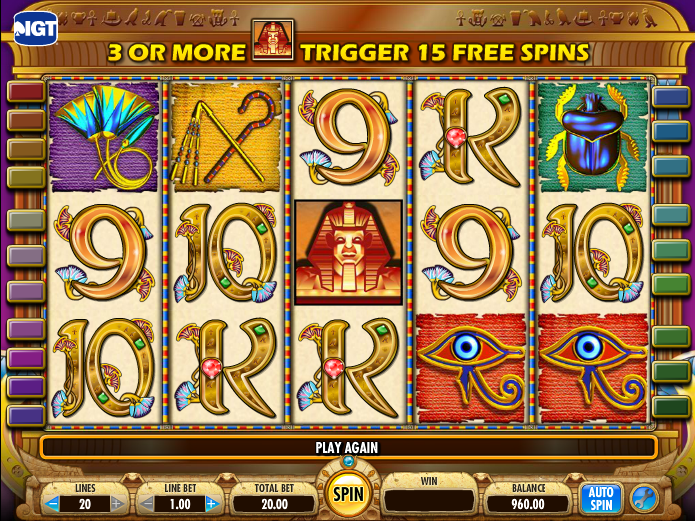

# Gambling Strategies for Penny Slot Players

*Note: If you or anyone else you know has a gambling problem, call the National Problem Gambling hotline: 1-800-522-4700*

My girlfriend and I like to hit the casino from time to time, and we get a kick out of the penny slots. We place small bets and aim to spend no more than 100 dollars total per session. Now - any "real" gambler would say that the slot machines are a waste of time because they favor the house much more than table games, where you actually make decisions that affect the outcome. And they'd be correct. But what can I say. We like slots!

The slots at the casino we go to roughly pay out 95\% of the money they take in over an infinite amount of time. This long-term percentage of payback is known as the **RTP**, or Return to Player. But we're not gambling for infinitely long and we don't have an infinite pool of money. Rather than thinking in these terms, we will consider a more realistic scenario. The question is: is there a superior strategy for someone gambling with hard spending and time limits? Or is everything so random under these constraints that you might as well do whatever you want?

### Task

We will play one game called Cleopatra by IGT (photo courtesy of [Wizard Of Odds](https://wizardofodds.com/games/slots/cleopatra/)).



We will study two versions of the game vary in what is called **volatility** - basically the payout variance. Highly volatile games pay out big but rarely, while low-volatility games distribute small payouts more often but the jackpot is not as large. Low-volatility machines have become quite popular with casino owners in Vegas as the small payouts keep people hooked and playing for longer.

We will run many simulations and see how the results change with our betting strategies. We will also consider what happens if we change the best size as we win, to see if we can improve our average returns.

You can view the Jupyter notebook with the results [here](https://nbviewer.jupyter.org/github/benmayersohn/penny-slots/blob/master/gambling.ipynb).

If you would like to run simulations yourself, refer to the files in the `simulation_scripts` folder. I would recommend cloning this repository and installing (within a virtual environment) using

```bash
python setup.py install
```

### Directory Structure

Below is a breakdown of the files in this repository.
<pre class="language-bash"><code class="language-bash">penny-slots
|____cleoslots            
| |____slots_models.py      # contains SlotsModel/CleopatraModel classes 
|____gambling.ipynb         # jupyter notebook
|____cleopatra.png          # picture of the game
|____setup.py               # for installation purposes
|____output                 # directory with output of simulations
|____README.md
|____simulation_scripts     # scripts for generating results stored in the output directory
|____expected_values.py     # used for getting probability distributions to achieve desired RTP 
</code></pre>
